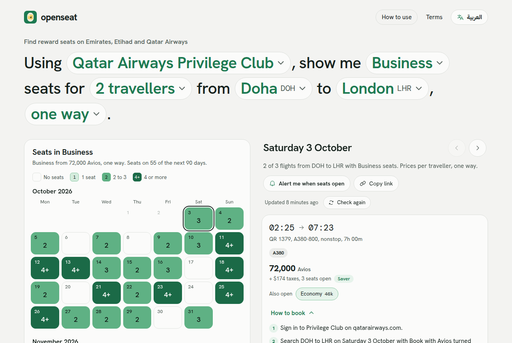
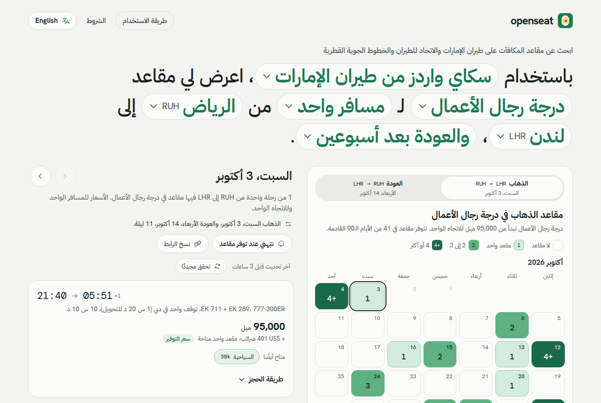
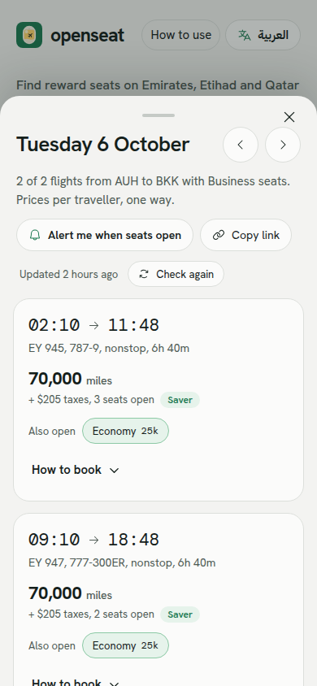
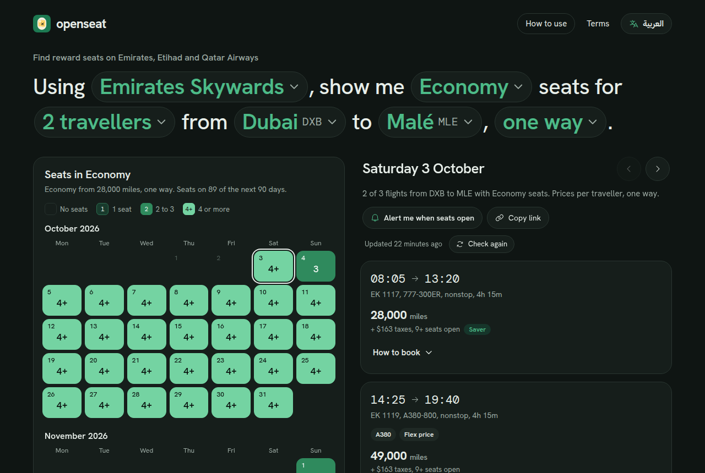
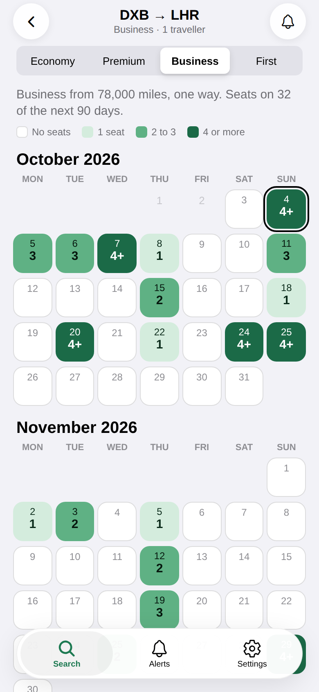
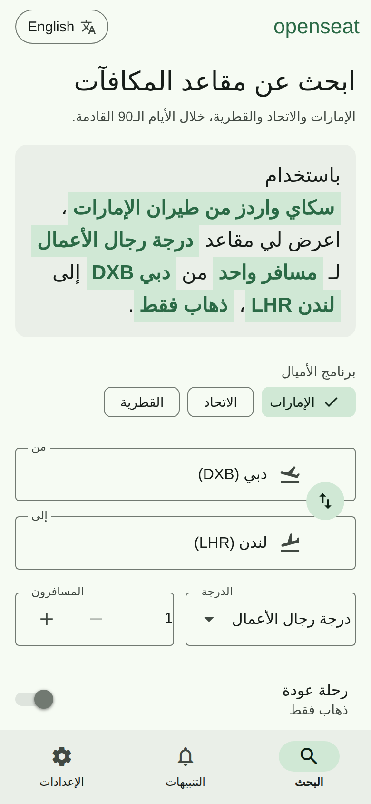

# openseat

openseat shows which of the next 90 days have reward seats on **Emirates Skywards**, **Etihad Guest** and **Qatar Airways Privilege Club**. You pick a day, see every flight with its miles and taxes, then book on the airline site with your own miles. openseat never sells tickets or touches miles.

The site works in English and Arabic (right to left), on desktop and phones, in light and dark mode. There are also native apps for iPhone and Android.

| English | Arabic |
| --- | --- |
|  |  |

| Phone | Dark mode |
| --- | --- |
|  |  |

| iPhone app | Android app in Arabic |
| --- | --- |
|  |  |

> Prices and seat counts are **sample data** until a real data source is plugged in. See [docs/data-sources.md](docs/data-sources.md).

## What is in this repo

```
apps/web         The website (Preact + Vite + TypeScript)
apps/api         The API (Node + Fastify + Postgres + Redis)
apps/mobile      The iOS and Android app (Expo + React Native + TypeScript)
packages/shared  Reference data, types, the sample data generator and day summaries
design/          Design prototypes, the handoff spec and app icons
deploy/          nginx config for the static site
docs/            Architecture, API and data source notes
```

## Quick start

You need Node 22 or newer.

```bash
npm install
npm run build -w @openseat/shared
npm run dev
```

Open http://localhost:5173. With no API configured, the site runs on built-in sample data in the browser, so this is all you need to work on the front end.

### Run the full stack

Start Postgres and Redis (or use Docker below), then in two terminals:

```bash
cp .env.example .env            # edit as needed
npm run dev:api                 # API on http://localhost:8787, runs migrations on start
VITE_API_URL=http://localhost:8787 npm run dev
```

The API also runs without Postgres or Redis. It then keeps data in memory and coordinates within one process, which is fine for local work.

### Mobile app

```bash
npm run dev:mobile
```

Scan the QR code with Expo Go, or press `i` or `a` for a simulator. It runs on sample data until you set `EXPO_PUBLIC_API_URL`. See [apps/mobile/README.md](apps/mobile/README.md) for store builds.

### Docker

```bash
docker compose up --build
```

Site on http://localhost:8080, API on http://localhost:8787, with Postgres and Redis alongside.

## Scripts

| Command | What it does |
| --- | --- |
| `npm run dev` | Website dev server |
| `npm run dev:api` | API dev server with reload |
| `npm run dev:mobile` | Mobile app dev server (Expo) |
| `npm run build` | Build shared, API and website |
| `npm run typecheck` | Type check every package |
| `npm test` | Run all tests. API tests also run against Postgres and Redis when `DATABASE_URL` and `REDIS_URL` are set |
| `npm run migrate` | Apply database migrations |

## How it works

1. **Search.** The search is a sentence: "Using Emirates Skywards, show me Business seats for 1 traveller from Dubai to London, one way." Each green part is a picker. The search lives in the URL (`?p=EK&o=DXB&d=LHR&c=business&n=1&r=0`), so links can be shared.
2. **Calendar.** Each day shows how many seats are open on its best flight (1, 2, 3 or 4+). A day counts only when one flight has enough seats for every traveller.
3. **Day.** Every flight that day, miles and taxes per traveller, other cabins open on the same flight, and the steps to book.
4. **Alert.** Turn on an email alert for a route and cabin. It fires when seats open, at most twice a day.

Results stream in. Days the API already has show at once, and the rest arrive in 15-day blocks as they are read. Each search has its own request id, so tabs never interfere, and leaving a search stops work nobody else needs. Identical searches from many people share one fetch per block. See [docs/architecture.md](docs/architecture.md).

## Language

The site follows the browser language: Arabic if the browser prefers Arabic, English otherwise. The switch in the header changes it at once and remembers the choice. `?lang=ar` or `?lang=en` in a link also works.

All copy lives in `apps/web/src/i18n/en.ts` and `ar.ts`. The mobile app reads the same files. A test fails if Arabic is missing any English string. The Arabic text, and the Terms page in both languages, should be reviewed by a native editor and by counsel before launch.

## Configuration

Every setting is in [.env.example](.env.example) with a short note. The ones that matter most in production:

- `DATABASE_URL`, `REDIS_URL`: storage and cross-instance coordination.
- `ALLOWED_ORIGINS`: exact origins allowed to call the API from a browser. There is no wildcard.
- `TRUST_PROXY=true` behind a load balancer, so rate limits see real client addresses.
- `SMTP_URL`, `MAIL_FROM`: alert email. Without them alerts go to the log.
- `VITE_API_URL` (web, build time): where the site finds the API. Leave empty for sample-data mode.

## Deploying

- **Website:** `npm run build -w @openseat/web` writes static files to `apps/web/dist`. Host them anywhere. `public/_headers` sets cache rules for Netlify or Cloudflare Pages; `deploy/nginx.conf` does the same for nginx. Hashed files under `/assets/` are cached for a year; HTML is always revalidated.
- **API:** `apps/api/Dockerfile`, or `npm run build -w @openseat/api` then `node apps/api/dist/index.js`. Run one or more instances behind a load balancer with shared Postgres and Redis. Put a CDN or WAF in front for bot protection.

## Status

Done:

- Web app from the design: search sentence, pickers, 90-day calendar, return trips, day panel and bottom sheet on phones, booking steps, alerts, copy link, How to use and Terms pages.
- Native apps for iOS and Android with the same features: the search sentence, 90-day calendar, day and flights, booking steps, email alerts, How to use and Terms. iOS and Android each get their own look. English and Arabic, following the phone language with a setting to change it, and light and dark mode. See [apps/mobile/README.md](apps/mobile/README.md).
- English and Arabic with right-to-left layout, and dark mode.
- API with streaming search, request merging, per-search ids, refresh with cooldowns, alerts with email, a tiered refresh scheduler, Postgres storage and Redis coordination.
- Tests for shared logic, the API (including real Postgres and Redis), the web app's URL and copy, and the mobile app's stream reader, links and copy.

Not done yet:

- **Real airline data.** Only the sample adapter exists. [docs/data-sources.md](docs/data-sources.md) explains the adapter contract.
- Tablet layouts for the native apps (two and three columns, in [design/HANDOFF.md](design/HANDOFF.md)). Tablets get the phone layout for now.
- Store release of the native apps. They build with EAS but are not yet in the App Store or Google Play.
- Telegram and WhatsApp alerts. The database accepts these channels; only email is wired up.
- Booking links that open the airline site with the search filled in. The airlines do not publish reward search URLs, so the button opens the home page.
- Bank points and partner program prices.
- Currency choice (AED, SAR, QAR). Taxes are estimates in US dollars.
- Bot checks (for example Turnstile) on the API. Rate limits and the origin allowlist are in place.

## Licence

No licence has been chosen for this code yet. Third-party parts keep their own: the fonts (Hanken Grotesk, DM Mono, IBM Plex Sans Arabic) are under the SIL Open Font Licence, and Phosphor icons under the MIT licence.
