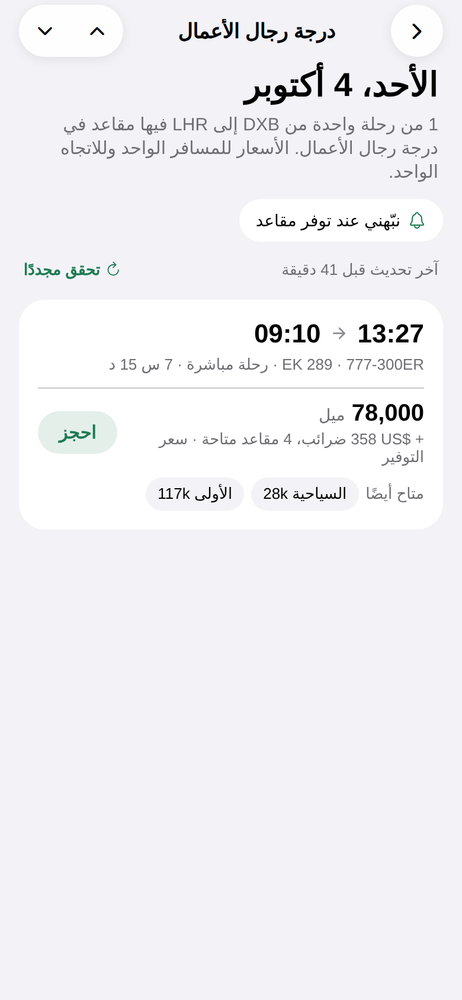
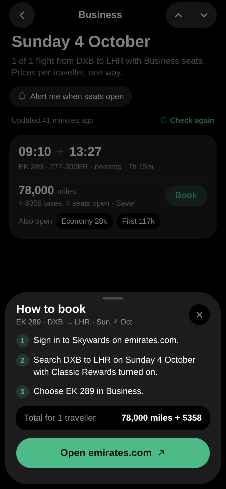

# openseat for iOS and Android

The native app, built with Expo (React Native, TypeScript, Expo Router). It does what the website does: the search sentence and its pickers, the 90-day calendar, the day with its flights, the steps to book, alerts by email, Telegram or WhatsApp, the currency for taxes, and the How to use and Terms pages.

It follows the design in `design/prototypes/Openseat Native Apps.dc.html` and section 2 of [design/HANDOFF.md](../../design/HANDOFF.md). iOS gets the iOS look and Android gets Material 3, from the same screens.

| iOS | Arabic | Android | Dark mode |
| --- | --- | --- | --- |
|  |  |  |  |

## Run it

From the repo root:

```bash
npm install
npm run dev:mobile
```

Then scan the QR code with **Expo Go** on your phone, or press `i` for the iOS simulator or `a` for the Android emulator. Press `w` to open it in a browser.

With no API set, the app runs on built-in sample data, the same as the website.

To use a local API, your phone must be able to reach it. Use your computer's address on the local network, not `localhost`:

```bash
EXPO_PUBLIC_API_URL=http://192.168.1.20:8787 npm run dev:mobile
```

## Settings

All are read at build time. Expo inlines `EXPO_PUBLIC_*` values into the app, so restart with `--clear` after you change one.

| Variable | What it does |
| --- | --- |
| `EXPO_PUBLIC_API_URL` | Where the app finds the API. Empty means sample data. |
| `EXPO_PUBLIC_WEB_URL` | The website, for shared links such as `https://openseat.app`. Empty hides the Share button. Also needed when the API has the Turnstile bot check on. |
| `EAS_PROJECT_ID` | Your EAS project id, from `eas init`. Only needed for EAS builds. |

Native apps do not send an `Origin` header, so the API's `ALLOWED_ORIGINS` list does not affect them. It does matter for the browser preview: add its address (for example `http://localhost:8081`) to `ALLOWED_ORIGINS`.

## Language and look

- The app follows the phone language: Arabic if the phone prefers Arabic, English otherwise. **Settings > Language** changes it at once and remembers the choice. The search screen also has a quick switch at the top.
- Arabic mirrors the whole layout. The app does this itself, so a change needs no restart.
- Light and dark mode follow the phone.
- The copy is shared with the website: the app reads the same language files, `languages/en.xml` and `languages/ar.xml` at the repo root. Lines only the app needs sit in the `app` group of each file. Metro loads the files as text through `xml-transformer.js`. A test fails if Arabic is missing any of them.
- In the browser preview, add `?look=android` to see the Android design.

## Build for the stores

Builds run on EAS. You need an Expo account.

```bash
npm install -g eas-cli
cd apps/mobile
eas init                     # once; put the project id in EAS_PROJECT_ID
eas build --profile preview  # test builds: an APK for Android, an ad hoc build for iOS
eas build --profile production --platform all
eas submit --platform all
```

Set `EXPO_PUBLIC_API_URL` and `EXPO_PUBLIC_WEB_URL` for each profile in `eas.json` or as EAS environment variables.

## Identity and icons

The name, bundle id (`app.openseat`), Android package and version are in one block at the top of [app.config.ts](app.config.ts). The bundle id and package cannot change once the app is in a store.

The icons come from `design/icons`:

- `assets/icon.png` is the 1024 px iOS icon.
- `assets/adaptive-foreground.png` and `assets/adaptive-monochrome.png` are the Android adaptive icon layers. The background is the brand green, set in `app.config.ts`.
- `assets/splash-icon.png` is the mark on the launch screen, which is light or dark to match the phone.

## Check your work

```bash
npm run typecheck -w @openseat/mobile
npm test -w @openseat/mobile
npm run export:web -w @openseat/mobile   # bundles the app; output in apps/mobile/dist
```

The tests cover the event stream reader, the search state in links, and the English and Arabic copy.

## How it is put together

```
src/app          Screens, one file per route (Expo Router)
src/components   Shared parts: calendar, flight card, sheets, tab bar
src/i18n         Language setting, app copy and number and date formats
src/lib          Search state, the event stream reader, alerts and storage
src/theme.ts     Colours for iOS and Android, light and dark
test/            Unit tests
```

On tablets the Search tab shows panes side by side (`src/components/Panes.tsx`), sized by window width (`src/lib/size.ts`):

- Under 600 points: the phone flow, one screen at a time.
- 600 to 839: search and calendar side by side. A tapped day opens on its own screen.
- 840 and up: search, calendar and day. Book opens the steps inside the flight card.

iPad puts the tabs along the top. Android tablets get a navigation rail with a button to turn on an alert. The search, calendar and day screens are the same components in both layouts, so a change to one shows on phones and tablets.

Search results stream from `GET /api/v1/search/stream` with a new request id for each search, read with a small XMLHttpRequest reader in `src/lib/stream.ts`. Leaving a search closes the stream.

Alerts live in `src/lib/alerts.ts` and `src/app/alert.tsx`. The form offers the channels `GET /api/v1/features` lists. For Telegram the app opens the bot after saving, and the alert starts when the person taps Start.

When the API asks for a Turnstile token, `src/lib/botcheck.ts` opens `/app-check/` on the website in the system browser sheet. The page runs the check and returns to `openseat://check?token=...`, which the sheet reads. `src/app/+native-intent.tsx` keeps the router from opening a screen for that link. See [docs/alerts.md](../../docs/alerts.md).

## Not done yet

- Push notifications. Alerts arrive by email, Telegram or WhatsApp.
